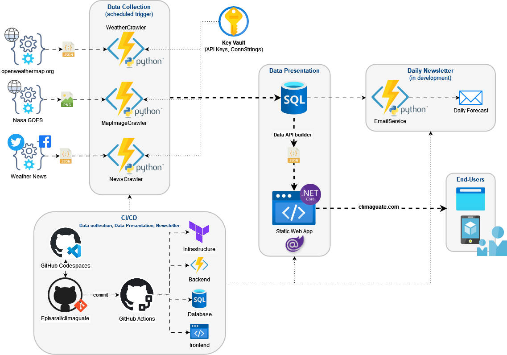

# 
By Eduardo Pivaral | <a href="https://www.linkedin.com/in/eduardo-pivaral/" target="_blank">LinkedIn</a> | <a href="https://x.com/Edu_Pivaral" target="_blank">Twitter/X</a>

_This project is no longer actively maintained or supported. The repository is kept online as a read-only archive for historical reference._

<a href="https://climaguate.com/" target="_blank">www.climaguate.com</a> is a weather forecast and agricultural index website for Guatemala.
It provides real-time information for 42 cities across the country, including current conditions, 12-hour forecasts, air quality, crop suitability scores, and animated NASA satellite imagery.

This website is a personal open-source project that demonstrates a full cloud solution with CI/CD and scalability using:
- Static web application using Azure Static Web Apps and **Blazor WebAssembly**
- Database storage using Azure SQL with schema-based organization
- Weather data collection using Azure Functions and Python (every 20 minutes)
- Hourly forecast collection using Azure Maps Weather API (every 12 hours)
- Air quality monitoring with AQI calculations (8 pollutants)
- Agricultural index with real-time crop suitability scoring (temperature + humidity + soil compatibility)
- Seasonal crop calendar and multi-city crop comparison assistant
- API exposed via Data API Builder (no hand-written REST layer)
- CI/CD using GitHub Actions
- Secure configuration using Azure Key Vault and Managed Identity


## Architecture Explanation

The diagram illustrates the architecture for a weather data collection, processing, and presentation system named Climaguate.




### 1. Data Collection (Scheduled Trigger)
Python-based Azure Functions triggered on schedule:

- **Current Weather Collector**: Collects real-time weather data from OpenWeatherMap API every 20 minutes for all cities
- **Air Quality Monitor**: Retrieves AQI levels and individual pollutant concentrations (CO, NO, NO₂, O₃, SO₂, PM2.5, PM10, NH₃)
- **Hourly Forecast Collector**: Fetches 12-hour detailed hourly forecasts from Azure Maps Weather API every 12 hours
- **Satellite Image Processor**: Downloads NASA GOES infrared satellite imagery, processes and crops images, adds location markers, and generates APNG animations

All functions use Managed Identity for secure Azure service access and retrieve API keys from Azure Key Vault.


### 2. Data Presentation

- **Azure SQL Database**: Stores weather data in organized schemas (`weather.*`, `agriculture.*`) with optimized stored procedures
- **Data API Builder (Azure Container Apps)**: Automatically generates REST APIs from stored procedures — no hand-written REST handlers
- **Blazor WebAssembly Static Web App**: Responsive front-end with interactive weather charts, AQI color coding, agricultural index, crop suitability scores, seasonal calendar, and NASA satellite animations
- **Azure Blob Storage**: Hosts processed satellite APNG animations organized by city

### 3. CI/CD

- **GitHub Actions**: Separate workflows for Frontend, Backend, Database, and DAB container deployments
- Automated deployments triggered by path-specific pushes to `main`

### 4. End-Users

- **Desktop & Mobile Browsers**: Accessing the web application through [www.climaguate.com](https://www.climaguate.com)

### Summary
Climaguate collects weather data via serverless functions, stores it in Azure SQL, exposes it via Data API Builder running in Azure Container Apps, and presents it through a Blazor WebAssembly SPA. The architecture is fully serverless with no always-on compute except the DAB container.

---

## 🚀 For Developers

### Tech Stack

**Frontend:**
- .NET 8 Blazor WebAssembly
- C# for component logic
- HTML/CSS with Bootstrap 5
- JavaScript for Chart.js integration (forecast chart, crop monthly bands, history chart)
- Azure Static Web Apps hosting

**Backend:**
- Python 3.12 Azure Functions (Consumption plan)
- Pillow for satellite image processing
- APNG library for animation creation
- pyodbc for SQL Server connectivity

**API Layer:**
- Microsoft Data API Builder running in Azure Container Apps
- No hand-written REST endpoints — all API responses auto-generated from stored procedures

**Database:**
- Azure SQL Database
- Schemas: `weather` (WeatherData, WeatherForecast, AirQuality, cities) and `agriculture` (Crops, CityCrops)
- SQL Database project with CI/CD deployment

**APIs & Services:**
- OpenWeatherMap API (current weather & air quality)
- Azure Maps Weather API (12-hour hourly forecasts)
- NASA GOES satellite imagery (public)

**Infrastructure:**
- Azure Resource Group: `climaguate_rg`
- Azure Key Vault: `ClimaguateSecrets`
- Azure Blob Storage: satellite APNG animations
- Azure Container Registry: DAB container image
- Azure Container Apps: Data API Builder (scales to 0 when idle)

**DevOps:**
- GitHub Actions CI/CD (4 workflows: frontend, backend, database, DAB container)
- Managed Identity for all Azure service authentication

### Prerequisites

**Development Environment:**
- Visual Studio Code with extensions: Azure Functions, C# Dev Kit, SQL Database Projects
- .NET 8 SDK
- Python 3.12+
- Azure Functions Core Tools v4
- Azure CLI (`az`)
- Docker Desktop (for DAB container local testing)

**Azure Resources:**
- Azure Subscription
- Resource Group
- SQL Database with configured firewall
- Key Vault with RBAC `Key Vault Secrets User` role
- Static Web App
- Storage Account
- Container Registry + Container Apps environment

**API Keys Required (stored in Key Vault):**
- `apikey` — OpenWeatherMap API key (free tier available)
- `azuremapskey` — Azure Maps subscription key
- `connstr-dab` — Azure SQL connection string (ADO.NET format, for DAB)
- `connstr` — Azure SQL connection string (ODBC format, for Python backend)

### Project Structure

```
climaguate/
├── frontend/               # Blazor WebAssembly application
│   ├── Client/             # Pages, components, wwwroot
│   │   ├── Pages/          # Home, Agriculture, WeatherHistory, CropCityReport, etc.
│   │   ├── Layout/         # NavMenu, MainLayout
│   │   ├── wwwroot/        # Static assets, CSS, JS, images
│   │   └── CitySlugHelper.cs  # Shared utilities (slugs, soil/climate descriptions)
│   └── Shared/             # Shared models
├── backend/                # Azure Functions (Python)
│   ├── function_app.py     # All timer-triggered functions
│   ├── requirements.txt
│   └── host.json
├── database/               # SQL Database project
│   ├── Crops.sql, CityCrops.sql, WeatherData.sql, ...
│   ├── get_crops_by_city.sql    # Suitability scoring SP
│   ├── CalculateSuitabilityScore.sql
│   └── Script.PostDeployment.sql  # Seed data + soil compatibility data
├── dab/                    # Data API Builder container
│   ├── dab-config.json     # DAB configuration (8 REST endpoints)
│   └── Dockerfile
├── infrastructure/         # Azure Data Factory (weekly data cleanup)
│   └── ADF/
└── .github/workflows/      # CI/CD pipelines
    ├── azure-static-web-apps-*.yml
    ├── main_weathercrawler.yml
    ├── sql-workflow.yml
    └── dab-container.yml
```

### Getting Started

1. **Clone Repository:**
   ```bash
   git clone https://github.com/Epivaral/climaguate.git
   cd climaguate
   ```

2. **Backend (Azure Functions):**
   ```bash
   cd backend
   python -m venv venv
   source venv/bin/activate  # Windows: venv\Scripts\activate
   pip install -r requirements.txt
   # Create local.settings.json with connstr, apikey, azuremapskey
   func start
   ```

3. **DAB container (local):**
   ```bash
   cd dab
   docker build -t climaguate-dab:local .
   docker run -p 5000:5000 \
     -e "DATABASE_CONNECTION_STRING=Server=tcp:...;..." \
     climaguate-dab:local
   # Test: http://localhost:5000/rest/GetCities
   ```

4. **Frontend:**
   ```bash
   cd frontend/Client
   dotnet restore
   dotnet run
   # App available at http://localhost:5xxx
   # Update wwwroot/appsettings.Development.json with DAB URL
   ```

5. **Database:**
   - Deploy `database/Database.sqlproj` via SQL Database Projects extension
   - Or push to `main` — GitHub Actions handles deployment automatically

### Key Features

**Agricultural Suitability Scoring:**
- Real-time score = climate score (temp 60% + humidity 40%) + soil compatibility bonus (+5 preferred / -8 avoided)
- Each city-crop pair has microclimate adjustments (altitude, exposure)
- 53 crops, 42 cities, 4 soil types (Andosol, Fluvisol, Acrisol, Regosol)
- Seasonal crop calendar: 12-month planting/harvest grid per city

**12-Hour Forecast:**
- Horizontal scrollable card strip with precipitation probability
- Chart.js visualization (precipitation bars, temperature + real-feel lines)

**Satellite Imagery:**
- NASA GOES-16 infrared images processed every 20 minutes
- Watermarked with weather icon, assembled into APNG animations
- Hosted in Azure Blob Storage, served by city code

**Air Quality:**
- OpenWeatherMap AQI (1–5 scale) + 8 individual pollutants
- SVG needle gauge with color-coded zones

### Configuration

**Key Vault Secrets:**
| Secret | Purpose |
|--------|---------|
| `connstr` | ODBC connection string (Python backend) |
| `connstr-dab` | ADO.NET connection string (DAB container) |
| `apikey` | OpenWeatherMap API key |
| `azuremapskey` | Azure Maps subscription key |

**Frontend `API_Prefix`** is set as an Azure Static Web App environment variable pointing to the Container Apps DAB URL.

### Deployment

All deployments are automated via GitHub Actions on push to `main`:

| Workflow | Trigger path | Deploys |
|----------|-------------|---------|
| `azure-static-web-apps-*.yml` | `frontend/Client/**` | Blazor WASM to Azure Static Web Apps |
| `main_weathercrawler.yml` | `backend/**` | Python Functions |
| `sql-workflow.yml` | `database/**` | SQL Database project |
| `dab-container.yml` | `dab/**` | DAB Docker image to ACR + Container Apps update |

### Contributing

1. Fork the repository
2. Create a feature branch
3. Submit a pull request with detailed description
4. Ensure all CI/CD checks pass

### License

This project is open-source and available under the MIT License.

---

# Our Logo

Chaac is the Maya god of rain. In Maya mythology, Chaac is considered an important deity who controls water and weather. He is depicted as a man with a large nose and sharp teeth, and carries a stone axe that he uses to strike the clouds and make it rain.

The ancient Maya relied on Chaac to ensure good harvests and maintain balance in nature. Even today, Chaac is revered in some indigenous communities in Guatemala as a symbol of fertility and prosperity.

The presence of Chaac in Climaguate is a reminder of the importance of water and weather in our lives. Through this website, we hope to provide accurate and useful information about the weather and agriculture in Guatemala, so that people can make informed decisions. Like Chaac, our goal is to help maintain balance and harmony in nature, and promote sustainability and environmental care.
