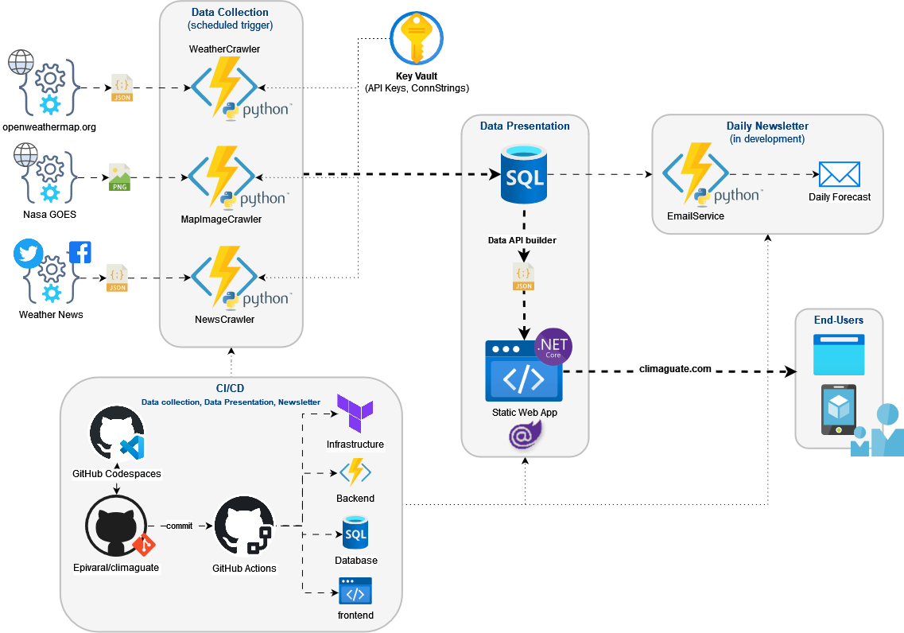

# 
By Eduardo Pivaral | <a href="https://www.linkedin.com/in/eduardo-pivaral/" target="_blank">LinkedIn</a> | <a href="https://x.com/Edu_Pivaral" target="_blank">Twitter/X</a>

<a href="https://climaguate.com/" target="_blank">www.climaguate.com</a> is a weather forecast website for Guatemala.
It provides up-to-date information about the weather in different regions of the country, including temperatures, atmospheric conditions, and short-term and long-term forecasts.


This website is a personal open-source project that demonstrates a full cloud solution with CI/CD and scalability using:
- Static web application using Azure Static Web Apps and Blazor Server
- Database storage using Azure SQL database with schema-based organization
- Weather data collection using Azure Functions and Python (every 15 minutes)
- Hourly forecast collection using Azure Maps Weather API (every 15 minutes)
- Air quality monitoring with AQI calculations
- Agricultural index and crop suitability recommendations
- City/crop recommendation assistant
- API documentation with Swagger-style UI
- CI/CD using GitHub Actions with multi-environment deployment
- IaC using Terraform for infrastructure management
- Secure configuration using Azure Key Vault


## Architecture Explanation

The diagram illustrates the architecture for a weather data collection, processing, and presentation system named Climaguate. The system is composed of several components working together to gather, process, and present weather-related data to end-users. 




### 1. Data Collection (Scheduled Trigger)
This section is responsible for collecting weather data from various sources at scheduled intervals. It comprises several Python-based Azure Functions:

- **Current Weather Collector**: Collects real-time weather data from OpenWeatherMap API every 15 minutes for all configured cities
- **Air Quality Monitor**: Retrieves air quality data including AQI levels and individual pollutant concentrations (CO, NO, NO2, O3, SO2, PM2.5, PM10, NH3)
- **Hourly Forecast Collector**: Fetches 12-hour detailed hourly forecasts from Azure Maps Weather API every 15 minutes
- **Satellite Image Processor**: Downloads NASA GOES infrared satellite imagery, processes and crops images, adds location markers, and generates animated timelines

All these functions use Azure Functions for serverless execution and retrieve API keys securely from Azure Key Vault. The system includes comprehensive error handling and logging for monitoring and debugging.


### 2. Data Presentation
This section handles the processing and presentation of collected data. It involves:

- **Azure SQL Database**: Stores weather data in organized schemas (weather.WeatherData, weather.WeatherForecast, weather.AirQuality, agriculture.Crops, agriculture.CityCrops) with optimized indexes for hourly data queries
- **Data API Builder**: Automatically generates REST APIs from database stored procedures, converting SQL results to JSON format. Includes endpoints for weather, air quality, and agricultural recommendations.
- **Blazor Server Static Web App**: A responsive front-end application with interactive weather charts, collapsible UI sections, AQI color coding, agricultural index, crop suitability, and 24-hour forecast visualizations
- **Azure Blob Storage**: Hosts processed satellite images and animated weather timelines organized by city

The website features real-time weather displays, interactive forecast charts with precipitation and temperature data, agricultural recommendations, and animated satellite imagery showing cloud movement patterns.

### 3. CI/CD (Continuous Integration/Continuous Deployment)
This section ensures that the codebase and infrastructure are consistently tested, integrated, and deployed. It includes:

- **GitHub Codespaces**: Provides a web-based development environment in Visual Studio Code, it is configured with all the required extensions so work can be resumed anywhere.
- **GitHub Actions**: Automates the build and deployment processes.

Code is committed to the Epivaral/climaguate repository on GitHub, which triggers the CI/CD pipelines by GitHub Actions.
There is one action for each component on the solution, that matches the folder structure: Infrastructure, Backend, Database, and Frontend.

### 4. End-Users
This section represents the final consumers of the weather data. The end-users can access the data through various devices:

- **Desktop Browsers**: Accessing the web application through [www.climaguate.com](http://www.climaguate.com).
- **Mobile Devices**: Viewing the weather data on smartphones and tablets via a responsive web application or a potential mobile app.


Additionally, there is an **Email Service** (in development) that will generate daily weather forecasts and send them to subscribers via email. Subscription will be available from the website once released.

### Summary
The Climaguate system is designed to efficiently collect, process, and present weather information to users via a web application. It leverages serverless functions for data collection, a robust database for storage, a .NET-based front-end for presentation, and an automated CI/CD pipeline for continuous improvement and deployment. 

This architecture ensures scalability, security, and ease of use for both developers and end-users.

---

## 🚀 For Developers

### Tech Stack

**Frontend:**
- .NET 8 Blazor Server
- C# for component logic
- HTML/CSS with responsive design
- JavaScript for Chart.js integration (custom plugins for threshold lines, month bands, tooltips)
- Custom weather metric icons for visual consistency
- Agricultural index and crop recommendation assistant
- API documentation page with Swagger-style UI
- Azure Static Web Apps hosting

**Backend:**
- Python 3.11 Azure Functions
- Azure Functions Core Tools
- Requests library for API calls
- PIL/Pillow for image processing
- APNG library for animation creation

**Database:**
- Azure SQL Database
- SQL Server Management Studio (SSMS)
- Database project with schema organization
- Optimized indexes for hourly forecast queries

**APIs & Services:**
- OpenWeatherMap API (current weather & air quality)
- Azure Maps Weather API (hourly forecasts)
- NASA GOES satellite imagery API
- Data API Builder (auto-generated REST APIs for weather, air quality, crops, recommendations)

**Infrastructure:**
- Azure Resource Group
- Azure Key Vault (secure configuration)
- Azure Blob Storage (image hosting)
- Azure SQL Server with firewall rules

**DevOps:**
- GitHub Actions (CI/CD)
- GitHub Codespaces (development environment)
- Terraform (Infrastructure as Code)
- Multi-environment deployment (dev/prod)

### Prerequisites

**Development Environment:**
- Visual Studio Code with extensions:
  - Azure Functions
  - Azure Account
  - C# Dev Kit
  - SQL Database Projects
- .NET 8 SDK
- Python 3.11+
- Azure Functions Core Tools v4
- SQL Server Management Studio (optional)

**Azure Resources:**
- Azure Subscription
- Resource Group
- SQL Database with configured firewall
- Key Vault with access policies
- Static Web App
- Storage Account

**API Keys Required:**
- OpenWeatherMap API key (free tier available)
- Azure Maps subscription key
- NASA GOES imagery (public API)

### Project Structure

```
climaguate/
├── frontend/           # Blazor Server application
│   ├── Client/         # Pages, components, wwwroot
│   └── Shared/         # Shared models and utilities
├── backend/            # Azure Functions (Python)
│   ├── function_app.py # Main functions file
│   ├── requirements.txt
│   └── host.json
├── database/           # SQL Database project
│   ├── WeatherData.sql
│   ├── WeatherForecast.sql
│   ├── AirQuality.sql
│   └── stored procedures
├── infrastructure/     # Terraform configurations
│   └── ADF/           # Azure Data Factory (future)
└── .github/           # GitHub Actions workflows
```

### Getting Started

1. **Clone Repository:**
   ```bash
   git clone https://github.com/Epivaral/climaguate.git
   cd climaguate
   ```

2. **Set up Azure Resources:**
   ```bash
   # Deploy infrastructure with Terraform
   cd infrastructure
   terraform init
   terraform plan
   terraform apply
   ```

3. **Configure Local Development:**
   ```bash
   # Backend (Azure Functions)
   cd backend
   python -m venv venv
   source venv/bin/activate  # On Windows: venv\Scripts\activate
   pip install -r requirements.txt
   
   # Create local.settings.json with your API keys
   cp local.settings.json.template local.settings.json
   # Edit local.settings.json with your values
   ```

4. **Database Setup:**
   - Deploy database project using SQL Database Projects extension
   - Or run SQL scripts manually in SSMS
   - Configure Data API Builder

5. **Frontend Setup:**
   ```bash
   cd frontend/Client
   dotnet restore
   dotnet run
   ```


### Key Features Implementation

**Agricultural Index & Crop Recommendations:**
- Real-time crop suitability scores based on current weather and city data
- Crop recommendation assistant for multi-city analysis
- Custom images for weather metrics (temperature, humidity, wind, sunrise, sunset)

**Hourly Weather Forecasts:**
- Azure Maps Weather API integration
- 24-hour forecasts updated every 15 minutes
- Single temperature values (not min/max ranges)
- Comprehensive weather data including wind, precipitation, visibility

**Interactive Charts:**
- Chart.js integration with custom color schemes and plugins (threshold lines, month bands, tooltips)
- Real-time precipitation visualization
- Temperature and "feels like" temperature comparison
- Responsive design for all device sizes

**Satellite Imagery:**
- NASA GOES infrared imagery processing
- Image cropping and location marker overlay
- APNG animation generation from image sequences
- Azure Blob Storage hosting with city-organized structure

**Air Quality Monitoring:**
- Real-time AQI calculations and color coding
- Individual pollutant tracking (PM2.5, PM10, Ozone, etc.)
- Health impact categorization (Good, Fair, Moderate, Poor, Very Poor)

**API Documentation:**
- Swagger-style API documentation page for all endpoints
- REST endpoints for weather, air quality, crops, recommendations


### Configuration

**Environment Variables (Azure Key Vault):**
- `connstr`: Azure SQL Database connection string
- `apikey`: OpenWeatherMap API key
- `azuremapskey`: Azure Maps subscription key

**Function App Settings:**
- Timer triggers for automated data collection
- Managed identity for secure Azure service access
- Memory-optimized image processing settings


### Deployment

**Automated CI/CD:**
- GitHub Actions workflows for each component
- Separate pipelines for Infrastructure, Backend, Database, Frontend
- Environment-specific deployments
- Automated testing and validation

**Manual Deployment:**
```bash
# Backend deployment
func azure functionapp publish <function-app-name>

# Frontend deployment
cd frontend/Client
az staticwebapp deploy
```


### Monitoring & Debugging

**Application Insights:**
- Function execution monitoring
- Performance metrics
- Error tracking and logging

**Database Monitoring:**
- Query performance insights
- Index usage statistics
- Storage utilization tracking

**Development Tips:**
- Use GitHub Codespaces for consistent development environment
- Monitor Function App logs in Azure Portal
- Test API endpoints with Data API Builder and Swagger-style docs
- Use browser developer tools for frontend debugging

### Contributing

1. Fork the repository
2. Create a feature branch
3. Follow coding standards and add tests
4. Submit a pull request with detailed description
5. Ensure all CI/CD checks pass

### License

This project is open-source and available under the MIT License.

---


# Our Logo

Chaac is the Maya god of rain. In Maya mythology, Chaac is considered an important deity who controls water and weather. He is depicted as a man with a large nose and sharp teeth, and carries a stone axe that he uses to strike the clouds and make it rain.

The ancient Maya relied on Chaac to ensure good harvests and maintain balance in nature. Even today, Chaac is revered in some indigenous communities in Guatemala as a symbol of fertility and prosperity.

The presence of Chaac in Climaguate is a reminder of the importance of water and weather in our lives. Through this website, we hope to provide accurate and useful information about the weather in Guatemala, including agricultural recommendations and crop suitability, so that people can be prepared and make informed decisions. 
Like Chaac, our goal is to help maintain balance and harmony in nature, and promote sustainability and environmental care.
